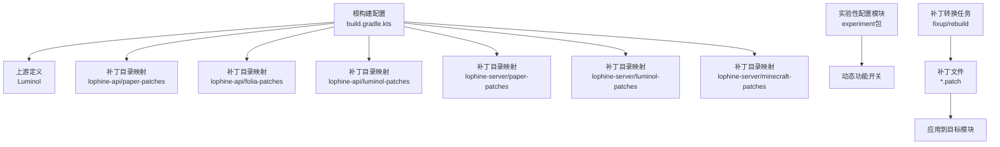
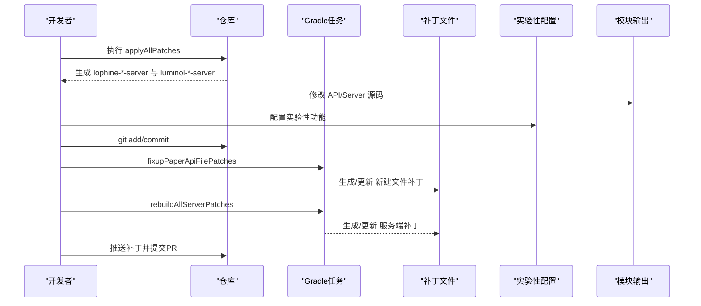
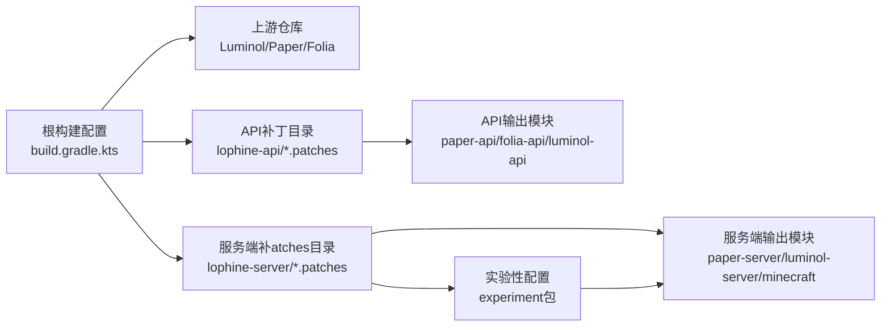
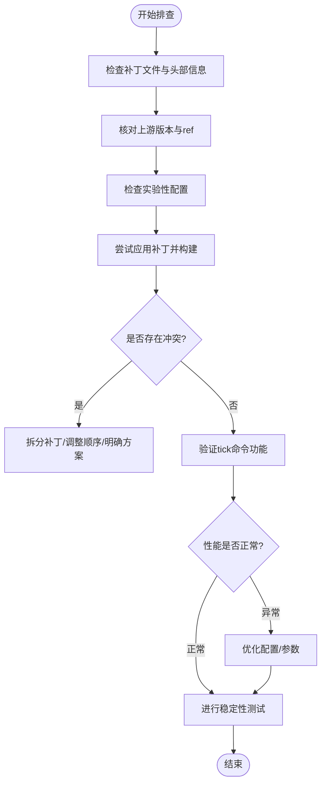

# 补丁管理

<cite>
**本文引用的文件**
- [build.gradle.kts](file://build.gradle.kts)
- [build.gradle.kts.patch](file://lophine-server/build.gradle.kts.patch)
- [.gitignore](file://.gitignore)
- [CONTRIBUTING.md](file://docs/CONTRIBUTING.md)
- [CONTRIBUTING_EN.md](file://docs/CONTRIBUTING_EN.md)
- [README.md](file://README.md)
- [README_EN.md](file://README_EN.md)
- [0032-Leaves-Catch-update-suppression-crash.patch](file://lophine-server/minecraft-patches/features/0032-Leaves-Catch-update-suppression-crash.patch)
- [FeatureSet.java](file://lophine-server/src/main/java/org/leavesmc/leaves/protocol/syncmatica/FeatureSet.java)
- [0007-Add-config-to-enable-tick-command.patch](file://lophine-server/minecraft-patches/features/0007-Add-config-to-enable-tick-command.patch)
- [GeneralCompatConfig.java](file://lophine-server/src/main/java/fun/bm/lophine/carpet/config/modules/GeneralCompatConfig.java)
- [CommandConfig.java](file://lophine-server/src/main/java/fun/bm/lophine/config/modules/experiment/CommandConfig.java)
- [LophineTpsAllCommand.java](file://lophine-server/src/main/java/fun/bm/lophine/feature/LophineTpsAllCommand.java)
</cite>

## 更新摘要
**所做更改**
- 新增tick命令配置功能章节，详细介绍0007补丁的增强内容
- 更新补丁分类与版本控制部分，增加实验性配置模块说明
- 新增服务器调试能力评估章节，涵盖tick命令对性能的影响
- 更新配置管理章节，增加CommandConfig配置模块的详细说明

## 目录
1. [简介](#简介)
2. [项目结构](#项目结构)
3. [核心组件](#核心组件)
4. [架构总览](#架构总览)
5. [组件详解](#组件详解)
6. [依赖关系分析](#依赖关系分析)
7. [性能考量](#性能考量)
8. [故障排查指南](#故障排查指南)
9. [结论](#结论)
10. [附录](#附录)

## 简介
本指南面向Lophine补丁管理系统，围绕补丁设计理念、分类与版本控制、应用流程、与上游项目的兼容性维护、开发与测试标准流程、冲突检测与解决、回滚与版本切换策略、工具使用与自动化脚本、以及对性能与稳定性的影响评估进行全面阐述。文档同时提供可视化图示帮助理解系统架构与关键流程。

**更新** 本次更新重点关注0007-Add-config-to-enable-tick-command.patch补丁的增强，该补丁从10行扩展到31行，新增了tick命令配置功能，显著提升了服务器调试能力。

## 项目结构
Lophine采用"上游分支 + 补丁层"的多仓库协同模式，通过Gradle插件与补丁文件实现对多个上游（如Luminol、Paper、Folia等）的增量式改造与集成。关键结构包括：
- 根级构建配置：定义上游仓库、补丁目录与输出目录映射
- API侧补丁：lophine-api 下按上游类型划分补丁目录（paper-patches、folia-patches、luminol-patches）
- 服务端补丁：lophine-server 下按上游类型划分补丁目录（paper-patches、luminol-patches、minecraft-patches）
- 实验性配置模块：新增experiment包下的配置管理，支持动态功能开关
- 补丁文件：以编号前缀命名的patch文件，遵循统一格式头与变更说明
- 构建产物：通过Gradle任务应用补丁并生成可运行/可测试的模块



**图表来源**
- [build.gradle.kts:9-41](file://build.gradle.kts#L9-L41)
- [build.gradle.kts.patch:1-37](file://lophine-server/build.gradle.kts.patch#L1-L37)
- [0007-Add-config-to-enable-tick-command.patch:1-187](file://lophine-server/minecraft-patches/features/0007-Add-config-to-enable-tick-command.patch#L1-L187)

**章节来源**
- [build.gradle.kts:1-41](file://build.gradle.kts#L1-L41)
- [build.gradle.kts.patch:1-37](file://lophine-server/build.gradle.kts.patch#L1-L37)
- [.gitignore:1-16](file://.gitignore#L1-L16)

## 核心组件
- 上游仓库与分支选择：通过根构建配置注册上游（如Luminol），并指定ref或gradle属性值，确保补丁应用与上游版本一致
- 补丁目录与输出映射：为每个上游API/Server分别建立patchesDir与outputDir，保证补丁仅作用于对应模块
- 实验性配置管理：新增experiment包下的CommandConfig模块，支持动态启用/禁用特定功能
- 补丁文件：以编号前缀命名，包含统一的头部信息（作者、主题、来源协议等），便于版本追踪与审查
- 构建与应用任务：通过Gradle任务将补丁应用到上游源码，生成可编译/可运行的模块；同时提供补丁修复与重建任务

**章节来源**
- [build.gradle.kts:9-41](file://build.gradle.kts#L9-L41)
- [build.gradle.kts.patch:1-37](file://lophine-server/build.gradle.kts.patch#L1-L37)
- [0032-Leaves-Catch-update-suppression-crash.patch:1-8](file://lophine-server/minecraft-patches/features/0032-Leaves-Catch-update-suppression-crash.patch#L1-L8)

## 架构总览
Lophine补丁系统的核心在于"以补丁为中心"的增量式改造与多上游协同。下图展示了从上游仓库到各模块补丁目录，再到最终构建产物的关键路径：

```mermaid
graph TB
subgraph "上游仓库"
U1["Luminol"]
U2["Paper/Folia 等"]
end
subgraph "补丁层"
PAPI["lophine-api/*.patches"]
PSVR["lophine-server/*.patches"]
END
subgraph "实验性配置"
EXPERIMENT["experiment包<br/>动态功能开关"]
END
subgraph "输出模块"
OAPI["paper-api / folia-api / luminol-api"]
OSVR["paper-server / luminol-server / minecraft 源码"]
END
U1 --> PAPI --> OAPI
U2 --> PSVR --> OSVR
PSVR --> EXPERIMENT --> OSVR
```

**图表来源**
- [build.gradle.kts:24-40](file://build.gradle.kts#L24-L40)

**章节来源**
- [build.gradle.kts:24-40](file://build.gradle.kts#L24-L40)

## 组件详解

### 补丁分类与版本控制
- 分类维度
  - API补丁：针对API层（Paper/Folia/Luminol）的接口扩展与行为调整
  - 服务端补丁：针对Minecraft原版服务器逻辑的修改与增强
  - 实验性补丁：新增experiment包下的配置管理，支持动态功能开关
- 版本控制策略
  - 编号前缀：所有补丁以四位递增序号开头，确保线性顺序与可追溯性
  - 头部信息：统一包含作者、主题、来源协议与许可证信息，便于审计与合规
  - 任务驱动：通过Gradle任务生成/重建补丁文件，避免手工编辑导致的不一致

**更新** 新增实验性配置模块，通过CommandConfig类实现动态功能开关，支持在运行时启用/禁用特定功能。

**章节来源**
- [0032-Leaves-Catch-update-suppression-crash.patch:1-8](file://lophine-server/minecraft-patches/features/0032-Leaves-Catch-update-suppression-crash.patch#L1-L8)
- [CONTRIBUTING.md:72-81](file://docs/CONTRIBUTING.md#L72-L81)
- [CONTRIBUTING_EN.md:72-82](file://docs/CONTRIBUTING_EN.md#L72-L82)

### 应用流程与兼容性维护
- 应用流程
  - 克隆与初始化：克隆仓库后执行applyAllPatches任务，生成各*-api与*-server目录
  - 修改与提交：在对应模块中进行修改，使用git提交但避免提交新建文件的修改
  - 补丁生成与重建：运行fixup与rebuild任务，生成或更新补丁文件
  - 推送与PR：将补丁文件推送到远端并提交PR
- 兼容性维护
  - 上游锁定：通过gradle属性或ref固定上游版本，确保补丁与上游同步
  - 仅考虑Luminol之后的提交：根仓库中的补丁仅包含Luminol最后一个提交之后的变更，避免引入无关改动



**图表来源**
- [CONTRIBUTING.md:43](file://docs/CONTRIBUTING.md#L43)
- [CONTRIBUTING.md:75-77](file://docs/CONTRIBUTING.md#L75-L77)
- [CONTRIBUTING_EN.md:46](file://docs/CONTRIBUTING_EN.md#L46)
- [CONTRIBUTING_EN.md:78-80](file://docs/CONTRIBUTING_EN.md#L78-L80)

**章节来源**
- [CONTRIBUTING.md:40-93](file://docs/CONTRIBUTING.md#L40-L93)
- [CONTRIBUTING_EN.md:43-96](file://docs/CONTRIBUTING_EN.md#L43-L96)
- [README.md:47](file://README.md#L47)
- [README_EN.md:47](file://README_EN.md#L47)

### 补丁开发与测试标准流程
- 开发阶段
  - 在lophine-*-api与lophine-*-server中进行修改
  - 使用git提交，避免提交新建文件的修改
  - 运行fixup任务生成/更新新建文件补丁
  - 运行rebuild任务生成/更新服务端补丁
- 测试阶段
  - 通过Gradle任务生成可运行/可测试的模块
  - 针对关键特性（如协议、计数器、假人、回放等）进行回归测试
  - 验证实验性配置功能的正确性与稳定性
- 合规与审查
  - 补丁头部包含来源与许可证信息
  - 保持补丁粒度合理，便于审查与回滚

**更新** 新增实验性配置功能的测试要求，确保动态功能开关的正确实现。

**章节来源**
- [CONTRIBUTING.md:72-81](file://docs/CONTRIBUTING.md#L72-L81)
- [CONTRIBUTING_EN.md:72-82](file://docs/CONTRIBUTING_EN.md#L72-L82)

### 冲突检测与解决
- 冲突检测
  - 应用补丁时若出现冲突，Gradle任务会提示冲突位置
  - 通过查看补丁文件与目标模块差异定位冲突范围
- 解决策略
  - 优先采用"先上游再下游"的顺序，减少跨上游冲突
  - 将大冲突拆分为多个小补丁，降低耦合度
  - 在补丁头部明确记录冲突原因与解决方案，便于后续审计

**章节来源**
- [CONTRIBUTING.md:82-92](file://docs/CONTRIBUTING.md#L82-L92)
- [CONTRIBUTING_EN.md:85-95](file://docs/CONTRIBUTING_EN.md#L85-L95)

### 回滚与版本切换策略
- 回滚策略
  - 通过git revert或删除对应补丁文件实现回滚
  - 结合rebuild任务重新生成受影响模块的补丁，确保一致性
- 版本切换策略
  - 切换上游ref或gradle属性，重新执行applyAllPatches
  - 逐个验证补丁是否可应用，必要时调整补丁顺序或内容

**章节来源**
- [CONTRIBUTING.md:82-92](file://docs/CONTRIBUTING.md#L82-L92)
- [build.gradle.kts:10-13](file://build.gradle.kts#L10-L13)

### 补丁管理工具与自动化脚本
- 关键任务
  - applyAllPatches：一次性应用所有上游补丁，生成各模块目录
  - fixupPaperApiFilePatches：处理新建文件的补丁生成
  - rebuildAllServerPatches：重建服务端补丁
- 自动化建议
  - 在CI中集成applyAllPatches与构建任务，确保补丁与构建的一致性
  - 使用脚本封装常用命令，减少重复劳动

**章节来源**
- [CONTRIBUTING.md:43](file://docs/CONTRIBUTING.md#L43)
- [CONTRIBUTING_EN.md:46](file://docs/CONTRIBUTING_EN.md#L46)
- [README.md:47](file://README.md#L47)
- [README_EN.md:47](file://README_EN.md#L47)

### 补丁对性能与稳定性的影响评估
- 影响评估维度
  - 协议与数据流：如协议特性集解析与匹配，需关注序列化/反序列化开销
  - 计数器与统计：全局实体计数等特性可能带来额外计算成本
  - 假人与回放：模拟行为与录制回放对CPU/IO的影响
  - 服务器调试：tick命令功能对性能的影响评估
- 评估方法
  - 基准测试：在相同条件下对比启用/禁用特定补丁的性能指标
  - 压力测试：模拟高负载场景，观察系统稳定性与资源占用
  - 日志与监控：结合日志与监控指标识别异常波动

**更新** 新增tick命令功能的性能影响评估，包括原子性更新机制和线程安全改进。

**章节来源**
- [FeatureSet.java:40-53](file://lophine-server/src/main/java/org/leavesmc/leaves/protocol/syncmatica/FeatureSet.java#L40-L53)

### tick命令配置功能详解
**新增** 0007补丁显著增强了tick命令功能，从简单的10行代码扩展到31行，提供了更强大的服务器调试能力。

#### 功能特性
- **动态启用/禁用**：通过CommandConfig.tick配置项控制tick命令功能的启用状态
- **原子性更新**：改进了tick速率更新机制，确保TIME_BETWEEN_TICKS和TICK_RATE的原子性更新
- **线程安全**：使用AtomicLong替代普通字段，确保跨区域线程的安全访问
- **异常处理**：增加了try-catch块防止异常导致调度器死亡
- **性能优化**：在非运行状态下跳过tick命令处理，减少不必要的开销

#### 配置选项
- **tick**：主开关，控制是否启用tick命令功能
- **tickCommandPermission**：覆盖/tick命令的权限级别，默认3级
- **tickFreezeCommandToggleable**：使/tick freeze命令在服务器已冻结时可切换回运行状态

#### 实现细节
补丁主要修改了以下核心组件：
- RegionizedServer：在全局tick中调用tickRateManager的方法
- TickRegionScheduler：实现动态tick速率计算和原子性更新
- ServerTickRateManager：添加原子性操作方法和线程安全改进
- TickCommand：提高最大tick速率限制

**章节来源**
- [0007-Add-config-to-enable-tick-command.patch:1-187](file://lophine-server/minecraft-patches/features/0007-Add-config-to-enable-tick-command.patch#L1-L187)
- [GeneralCompatConfig.java:185-208](file://lophine-server/src/main/java/fun/bm/lophine/carpet/config/modules/GeneralCompatConfig.java#L185-L208)
- [CommandConfig.java](file://lophine-server/src/main/java/fun/bm/lophine/config/modules/experiment/CommandConfig.java)

## 依赖关系分析
- 组件耦合
  - 根构建配置集中管理上游与补丁映射，降低模块间耦合
  - 补丁目录与输出目录一一对应，避免跨模块污染
  - 实验性配置模块通过CommandConfig统一管理功能开关
- 外部依赖
  - JDK 21+、Git、Gradle插件（paperweight相关）
  - 上游仓库（Luminol、Paper、Folia等）



**图表来源**
- [build.gradle.kts:9-41](file://build.gradle.kts#L9-L41)

**章节来源**
- [build.gradle.kts:9-41](file://build.gradle.kts#L9-L41)

## 性能考量
- 补丁粒度与复杂度
  - 小而精的补丁更易维护与测试，减少潜在性能风险
  - 新增的tick命令功能经过优化，避免不必要的性能开销
- 构建与应用效率
  - 使用增量构建与缓存策略，缩短补丁应用时间
- 运行时开销
  - 对高频路径（如协议处理、计数器）进行性能基准测试，避免引入瓶颈
  - tick命令功能在非启用状态下几乎无性能影响
- 线程安全与原子性
  - 使用AtomicLong确保跨区域线程的安全访问
  - 原子性更新机制避免竞态条件和数据不一致

**更新** 新增tick命令功能的性能优化措施，包括原子性更新和线程安全改进。

## 故障排查指南
- 常见问题
  - 补丁应用失败：检查上游版本与补丁顺序，必要时调整补丁或上游ref
  - 新建文件未纳入补丁：运行fixup任务生成相应补丁
  - 冲突频繁：拆分补丁、优化依赖顺序、明确冲突处理方案
  - tick命令功能异常：检查CommandConfig.tick配置项设置
- 定位手段
  - 查看补丁文件头部与变更说明，确认来源与影响范围
  - 对照目标模块差异，定位具体冲突位置
  - 检查实验性配置模块的正确性
- 处理流程



**图表来源**
- [CONTRIBUTING.md:82-92](file://docs/CONTRIBUTING.md#L82-L92)
- [CONTRIBUTING_EN.md:85-95](file://docs/CONTRIBUTING_EN.md#L85-L95)

**章节来源**
- [CONTRIBUTING.md:82-92](file://docs/CONTRIBUTING.md#L82-L92)
- [CONTRIBUTING_EN.md:85-95](file://docs/CONTRIBUTING_EN.md#L85-L95)

## 结论
Lophine补丁管理系统通过"以补丁为中心"的多上游协同模式，实现了对API与服务端的精细化改造与版本化管理。依托统一的补丁格式、规范化的开发与测试流程、完善的冲突检测与解决机制，以及可量化的性能与稳定性评估，能够有效保障系统的可维护性与长期演进能力。

**更新** 本次更新重点强化了实验性配置管理功能，特别是0007补丁的tick命令增强，为服务器调试提供了更强大、更灵活的工具。新的配置系统支持动态功能开关，既保证了功能的灵活性，又确保了系统的稳定性和性能表现。

建议在团队协作中严格遵循本文档的流程与最佳实践，持续优化补丁质量与应用效率，充分利用实验性配置功能提升服务器管理和调试体验。

## 附录
- 快速参考
  - 初始化与应用：执行applyAllPatches任务
  - 新增补丁：修改源码 -> git提交 -> fixup -> rebuild -> 推送PR
  - 修改补丁：fixup提交 -> 自动变基 -> 重新生成补丁 -> 推送PR
  - 实验性配置：通过CommandConfig管理功能开关
- 相关文件
  - 根构建配置：[build.gradle.kts](file://build.gradle.kts)
  - 服务端补丁配置：[build.gradle.kts.patch](file://lophine-server/build.gradle.kts.patch)
  - 贡献指南（中文）：[CONTRIBUTING.md](file://docs/CONTRIBUTING.md)
  - 贡献指南（英文）：[CONTRIBUTING_EN.md](file://docs/CONTRIBUTING_EN.md)
  - 补丁示例：[0032-Leaves-Catch-update-suppression-crash.patch](file://lophine-server/minecraft-patches/features/0032-Leaves-Catch-update-suppression-crash.patch)
  - tick命令补丁：[0007-Add-config-to-enable-tick-command.patch](file://lophine-server/minecraft-patches/features/0007-Add-config-to-enable-tick-command.patch)
  - 协议特性集解析：[FeatureSet.java](file://lophine-server/src/main/java/org/leavesmc/leaves/protocol/syncmatica/FeatureSet.java)
  - 通用配置模块：[GeneralCompatConfig.java](file://lophine-server/src/main/java/fun/bm/lophine/carpet/config/modules/GeneralCompatConfig.java)
  - 实验性配置模块：[CommandConfig.java](file://lophine-server/src/main/java/fun/bm/lophine/config/modules/experiment/CommandConfig.java)
  - TPS统计命令：[LophineTpsAllCommand.java](file://lophine-server/src/main/java/fun/bm/lophine/feature/LophineTpsAllCommand.java)