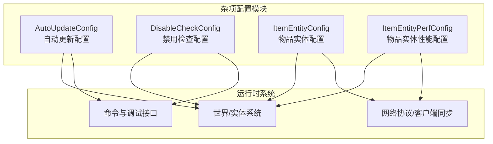
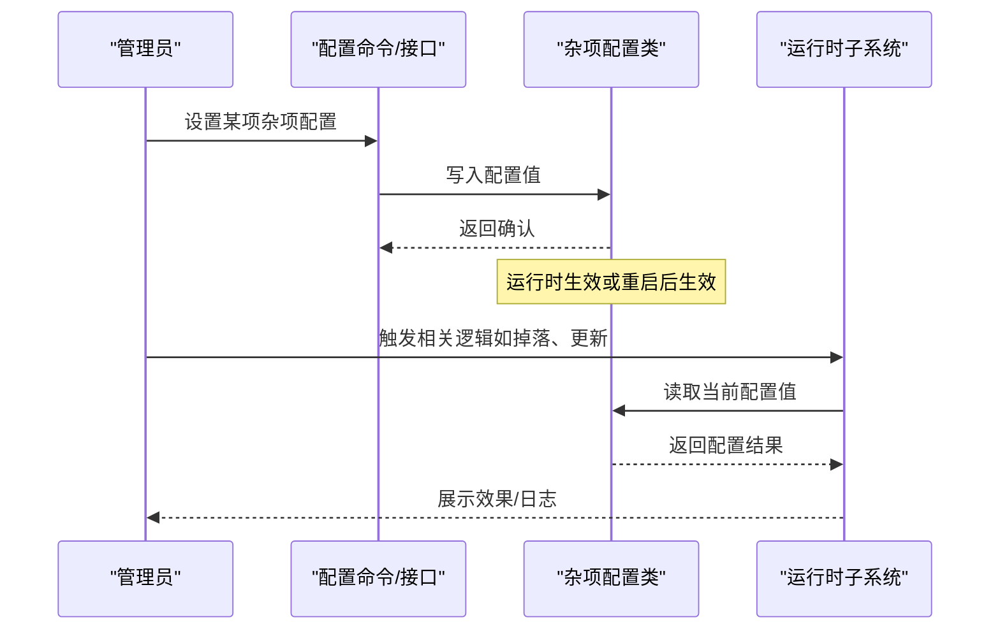
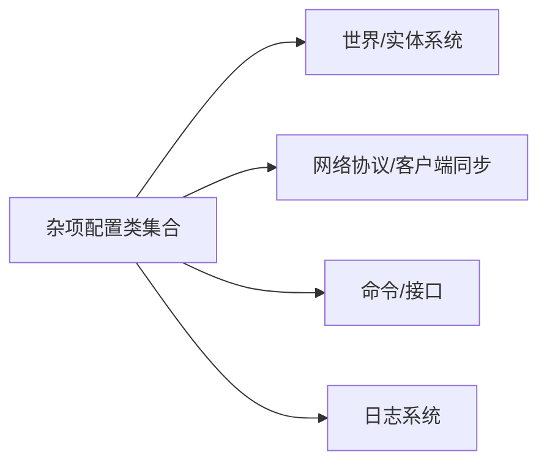

# 杂项配置

<cite>
**本文引用的文件**
- [AutoUpdateConfig.java](file://lophine-server/src/main/java/fun/bm/lophine/config/modules/misc/AutoUpdateConfig.java)
- [DisableCheckConfig.java](file://lophine-server/src/main/java/fun/bm/lophine/config/modules/misc/DisableCheckConfig.java)
- [ItemEntityConfig.java](file://lophine-server/src/main/java/fun/bm/lophine/config/modules/misc/ItemEntityConfig.java)
- [ItemEntityPerfConfig.java](file://lophine-server/src/main/java/fun/bm/lophine/config/modules/misc/ItemEntityPerfConfig.java)
</cite>

## 目录
1. [简介](#简介)
2. [项目结构](#项目结构)
3. [核心组件](#核心组件)
4. [架构总览](#架构总览)
5. [详细组件分析](#详细组件分析)
6. [依赖关系分析](#依赖关系分析)
7. [性能考量](#性能考量)
8. [故障排除指南](#故障排除指南)
9. [结论](#结论)
10. [附录](#附录)

## 简介
本文件系统性梳理 Lophine 杂项配置模块，聚焦以下四类配置：自动更新配置、禁用检查配置、物品实体配置、物品实体性能配置。文档从功能作用、适用场景、配置方法、参数说明与推荐值、对服务器性能的影响与优化建议、最佳实践与注意事项、以及常见问题排查等方面进行深入说明，帮助管理员在保证稳定性的同时获得更优的游戏体验与运行效率。

## 项目结构
杂项配置位于 Lophine 服务端模块中，采用按功能域分层组织：
- 配置入口与模块化：各配置以独立类实现，统一归档于 misc 包下，便于维护与扩展。
- 功能边界清晰：每类配置仅负责自身领域的开关与阈值控制，避免耦合。
- 与核心系统集成：配置通过 Lophine 的配置框架加载，并在运行时被相关子系统读取与应用。

图表来源
- [AutoUpdateConfig.java](file://lophine-server/src/main/java/fun/bm/lophine/config/modules/misc/AutoUpdateConfig.java)
- [DisableCheckConfig.java](file://lophine-server/src/main/java/fun/bm/lophine/config/modules/misc/DisableCheckConfig.java)
- [ItemEntityConfig.java](file://lophine-server/src/main/java/fun/bm/lophine/config/modules/misc/ItemEntityConfig.java)
- [ItemEntityPerfConfig.java](file://lophine-server/src/main/java/fun/bm/lophine/config/modules/misc/ItemEntityPerfConfig.java)

章节来源
- [AutoUpdateConfig.java](file://lophine-server/src/main/java/fun/bm/lophine/config/modules/misc/AutoUpdateConfig.java)
- [DisableCheckConfig.java](file://lophine-server/src/main/java/fun/bm/lophine/config/modules/misc/DisableCheckConfig.java)
- [ItemEntityConfig.java](file://lophine-server/src/main/java/fun/bm/lophine/config/modules/misc/ItemEntityConfig.java)
- [ItemEntityPerfConfig.java](file://lophine-server/src/main/java/fun/bm/lophine/config/modules/misc/ItemEntityPerfConfig.java)

## 核心组件
- 自动更新配置（AutoUpdateConfig）
  - 职责：控制与“自动更新”相关的机制行为，如更新频率、触发条件、影响范围等。
  - 关键点：通常用于减少不必要的频繁更新，降低 tick 压力；可配合其他配置形成组合拳。
- 禁用检查配置（DisableCheckConfig）
  - 职责：提供若干“禁用检查”的开关，用于在特定场景下跳过某些校验或限制，换取更高的灵活性或性能。
  - 关键点：需谨慎开启，避免破坏游戏平衡或引入异常行为。
- 物品实体配置（ItemEntityConfig）
  - 职责：定义物品实体（掉落物）的行为规则，如合并策略、拾取延迟、共享范围、最大数量等。
  - 关键点：直接影响玩家拾取体验与服务器 tick 开销。
- 物品实体性能配置（ItemEntityPerfConfig）
  - 职责：针对物品实体处理的性能优化参数，如合并检测阈值、批处理大小、缓存策略等。
  - 关键点：在高密度掉落场景下尤为关键，能显著降低 CPU 与内存压力。

章节来源
- [AutoUpdateConfig.java](file://lophine-server/src/main/java/fun/bm/lophine/config/modules/misc/AutoUpdateConfig.java)
- [DisableCheckConfig.java](file://lophine-server/src/main/java/fun/bm/lophine/config/modules/misc/DisableCheckConfig.java)
- [ItemEntityConfig.java](file://lophine-server/src/main/java/fun/bm/lophine/config/modules/misc/ItemEntityConfig.java)
- [ItemEntityPerfConfig.java](file://lophine-server/src/main/java/fun/bm/lophine/config/modules/misc/ItemEntityPerfConfig.java)

## 架构总览
杂项配置模块通过统一的配置框架加载，运行时由各子系统按需读取。其交互关系如下：

图表来源
- [AutoUpdateConfig.java](file://lophine-server/src/main/java/fun/bm/lophine/config/modules/misc/AutoUpdateConfig.java)
- [DisableCheckConfig.java](file://lophine-server/src/main/java/fun/bm/lophine/config/modules/misc/DisableCheckConfig.java)
- [ItemEntityConfig.java](file://lophine-server/src/main/java/fun/bm/lophine/config/modules/misc/ItemEntityConfig.java)
- [ItemEntityPerfConfig.java](file://lophine-server/src/main/java/fun/bm/lophine/config/modules/misc/ItemEntityPerfConfig.java)

## 详细组件分析

### 自动更新配置（AutoUpdateConfig）
- 功能作用
  - 控制自动更新的触发节奏与范围，避免过度更新导致的 tick 波峰。
  - 可与“禁用检查”等配置联动，形成更精细的更新策略。
- 适用场景
  - 高负载服务器：通过降低更新频率缓解 CPU 压力。
  - 大型红石/自动化农场：减少频繁状态变化带来的连锁更新。
- 配置方法
  - 通过配置命令或配置文件设置对应参数；部分参数可能需要重启生效。
- 参数说明与推荐值
  - 更新间隔：根据服务器 tick 时间与负载情况调整，建议从保守值起步，逐步调优。
  - 影响范围：限定到区块或区域，避免全局扫描造成抖动。
- 对性能的影响
  - 合理降低更新频率可显著减少 tick 开销；但过低可能导致响应迟滞。
- 最佳实践
  - 先启用最小化更新范围，再逐步扩大；结合监控指标观察效果。
  - 在高峰时段保持保守策略，在低峰时段适度放宽。
- 注意事项
  - 与“禁用检查”类配置协同使用时，需评估对游戏平衡的影响。

章节来源
- [AutoUpdateConfig.java](file://lophine-server/src/main/java/fun/bm/lophine/config/modules/misc/AutoUpdateConfig.java)

### 禁用检查配置（DisableCheckConfig）
- 功能作用
  - 提供若干“禁用检查”的开关，允许在特定情况下跳过某些校验或限制。
- 适用场景
  - 调试模式：临时关闭某些检查以便定位问题。
  - 特殊玩法：在自定义地图或模组环境中，关闭不适用的检查。
- 配置方法
  - 通过配置命令或配置文件设置；部分检查可能涉及安全风险，需谨慎开启。
- 参数说明与推荐值
  - 每个检查项应单独开关，建议默认关闭，按需开启。
- 对性能的影响
  - 关闭不必要的检查可减少判断开销；但可能掩盖潜在问题。
- 最佳实践
  - 仅在开发或测试环境长期开启；生产环境尽量保持默认。
  - 记录每次变更，便于回溯与审计。
- 注意事项
  - 不要盲目全量开启，优先选择与当前问题直接相关的检查项。

章节来源
- [DisableCheckConfig.java](file://lophine-server/src/main/java/fun/bm/lophine/config/modules/misc/DisableCheckConfig.java)

### 物品实体配置（ItemEntityConfig）
- 功能作用
  - 定义掉落物实体的行为规则，如合并、拾取延迟、共享范围、最大数量等。
- 适用场景
  - 高密度掉落（挖矿、刷怪、合成）场景：通过合并与范围控制提升体验。
  - 大规模多人服务器：通过限制单格掉落数量避免卡顿。
- 配置方法
  - 通过配置命令或配置文件设置；部分参数可能影响客户端显示一致性。
- 参数说明与推荐值
  - 合并半径/阈值：根据掉落密集度调整，避免过多小堆。
  - 拾取延迟：平衡公平性与流畅性，避免“抢夺”或“卡顿”。
  - 最大数量：防止极端情况下的内存与性能问题。
- 对性能的影响
  - 合理的合并与上限可显著降低实体数量与 tick 处理量。
- 最佳实践
  - 先观察玩家反馈与性能指标，再微调参数。
  - 结合“物品实体性能配置”共同优化。
- 注意事项
  - 与客户端协议/显示相关联的参数需谨慎修改，避免出现视觉错位。

章节来源
- [ItemEntityConfig.java](file://lophine-server/src/main/java/fun/bm/lophine/config/modules/misc/ItemEntityConfig.java)

### 物品实体性能配置（ItemEntityPerfConfig）
- 功能作用
  - 针对物品实体处理的性能优化参数，如合并检测阈值、批处理大小、缓存策略等。
- 适用场景
  - 高密度掉落与大量实体并发：通过批处理与缓存降低 CPU 与内存压力。
  - 长时间稳定运行：通过合理的缓存与批处理维持稳定的帧率与 TPS。
- 配置方法
  - 通过配置命令或配置文件设置；部分参数可能影响实时性与资源占用。
- 参数说明与推荐值
  - 批处理大小：根据服务器核心数与负载动态调整，避免过大批次导致延迟。
  - 缓存容量：平衡内存占用与命中率，避免频繁 GC。
  - 合并检测阈值：在保证体验的前提下尽量提高阈值以减少计算。
- 对性能的影响
  - 合理的批处理与缓存可显著降低 tick 开销与内存抖动。
- 最佳实践
  - 使用基准测试工具对比不同参数组合的效果。
  - 在低峰期进行压测，记录 TPS、内存与延迟指标。
- 注意事项
  - 过度优化可能牺牲实时性，需权衡用户体验与系统稳定性。

章节来源
- [ItemEntityPerfConfig.java](file://lophine-server/src/main/java/fun/bm/lophine/config/modules/misc/ItemEntityPerfConfig.java)

## 依赖关系分析
- 组件内聚与耦合
  - 四类配置各自职责明确，内部耦合度低，便于独立维护与演进。
- 直接与间接依赖
  - 与世界/实体系统存在直接依赖，用于读取与应用配置。
  - 与网络协议/客户端同步存在间接依赖，尤其是物品实体显示相关参数。
- 外部依赖与集成点
  - 依赖 Lophine 配置框架与命令系统；与日志系统集成以输出配置变更与运行状态。
- 接口契约
  - 配置类对外暴露统一的读写接口，确保运行时访问的一致性。

图表来源
- [AutoUpdateConfig.java](file://lophine-server/src/main/java/fun/bm/lophine/config/modules/misc/AutoUpdateConfig.java)
- [DisableCheckConfig.java](file://lophine-server/src/main/java/fun/bm/lophine/config/modules/misc/DisableCheckConfig.java)
- [ItemEntityConfig.java](file://lophine-server/src/main/java/fun/bm/lophine/config/modules/misc/ItemEntityConfig.java)
- [ItemEntityPerfConfig.java](file://lophine-server/src/main/java/fun/bm/lophine/config/modules/misc/ItemEntityPerfConfig.java)

章节来源
- [AutoUpdateConfig.java](file://lophine-server/src/main/java/fun/bm/lophine/config/modules/misc/AutoUpdateConfig.java)
- [DisableCheckConfig.java](file://lophine-server/src/main/java/fun/bm/lophine/config/modules/misc/DisableCheckConfig.java)
- [ItemEntityConfig.java](file://lophine-server/src/main/java/fun/bm/lophine/config/modules/misc/ItemEntityConfig.java)
- [ItemEntityPerfConfig.java](file://lophine-server/src/main/java/fun/bm/lophine/config/modules/misc/ItemEntityPerfConfig.java)

## 性能考量
- 自动更新配置
  - 降低更新频率可减少 tick 压力，但需注意响应性与一致性。
- 禁用检查配置
  - 关闭不必要检查可节省 CPU，但会增加风险，建议仅在可控环境下使用。
- 物品实体配置
  - 合理的合并与上限能显著减少实体数量，改善 TPS 与内存占用。
- 物品实体性能配置
  - 批处理与缓存是关键优化手段，需结合硬件能力与负载特征调优。
- 综合建议
  - 采用渐进式调优策略，先从保守参数开始，逐步逼近最优。
  - 建立基线指标（TPS、内存、延迟），定期回归测试，防止配置漂移。

## 故障排除指南
- 常见问题与症状
  - 物品堆积过多：检查物品实体配置中的合并与上限参数是否过低。
  - 拾取延迟明显：适当降低拾取延迟或优化客户端显示相关参数。
  - TPS 波动：检查自动更新频率与禁用检查的组合是否过于激进。
  - 实体过多导致卡顿：启用或加大物品实体性能配置的批处理与缓存。
- 排查步骤
  - 逐项复现问题，缩小到具体配置项。
  - 修改单一参数并观察指标变化，避免多参数同时变动。
  - 查看日志中关于配置加载与运行时应用的信息。
- 解决方案
  - 针对性地调整参数，必要时回退到上一个稳定版本的配置。
  - 在低峰期进行压测，验证修复效果后再推广到全服。

## 结论
杂项配置模块通过精细化的参数控制，为服务器在性能与体验之间找到平衡提供了有效手段。建议管理员遵循“先保守、后放开”的原则，结合监控指标与玩家反馈持续迭代，确保配置始终贴合实际运行状况。

## 附录
- 快速参考
  - 自动更新：优先控制范围与频率，避免全局高频更新。
  - 禁用检查：默认关闭，仅在特殊场景短期启用。
  - 物品实体：以合并与上限为核心优化点，兼顾公平性与性能。
  - 物品实体性能：通过批处理与缓存提升吞吐，平衡内存占用。
- 变更流程建议
  - 变更前备份配置；变更后至少观察 24 小时；建立变更记录与回滚预案。