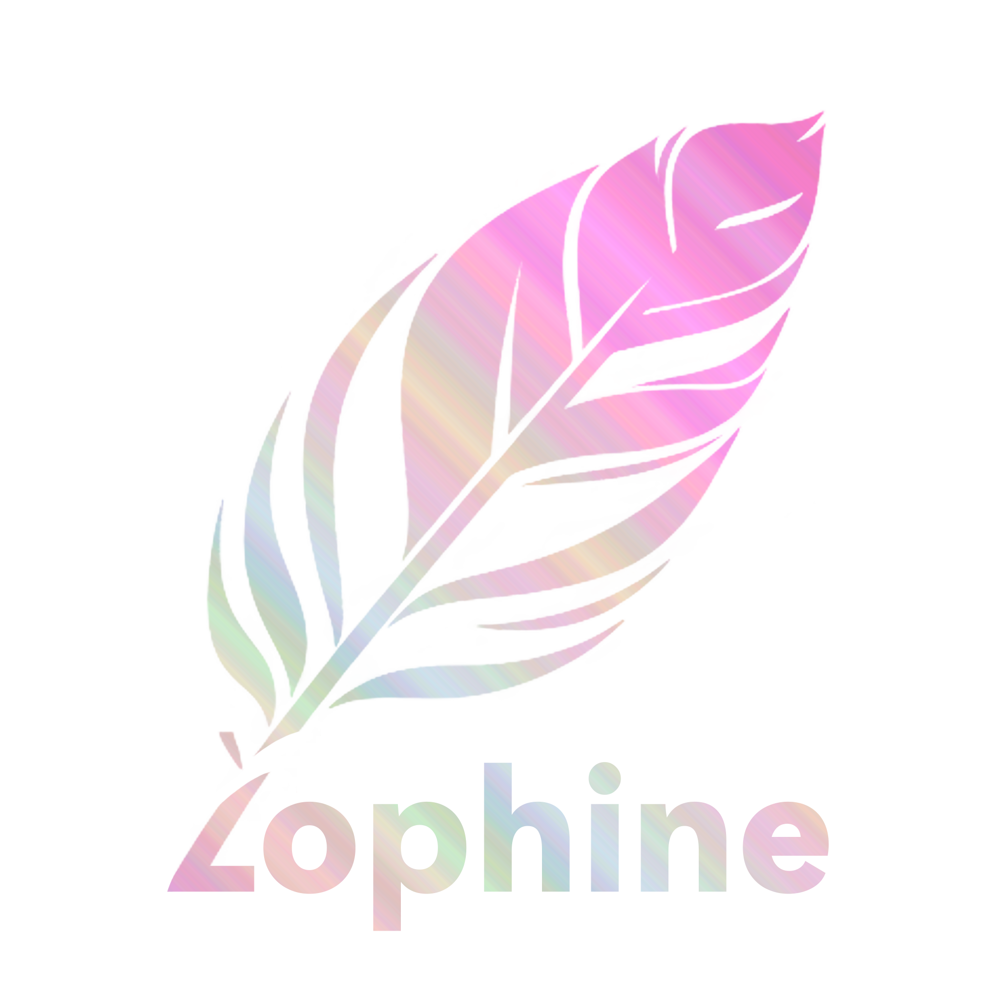

<div align="center">
  
  
  # Lophine
  
  *Lophine 是一个基于Luminol的分支，具有许多有用的优化和可配置的原版特性，目标是在Folia上实现更多生电的内容（请注意，完整生电请使用Fabric）*
  
  
  [](LICENSE.md)
  [](https://github.com/LuminolMC/Lophine/issues)
  
  
  
  
  
  
  
  [English](./README_EN.md) | **中文**
</div>

---

## ✨ 核心特性

- 🔧 **可配置的原版特性** - 灵活调整游戏机制以适应不同服务器需求
- 📊 **Tpsbar 支持** - 实时显示服务器 TPS 状态
- 🐛 **Folia Bug 修复** - 针对 Folia 已知问题的专项修复
- 💾 **多存档格式支持** - 支持 linear 和 b_linear（linear 重新实现）存档格式
- 🔬 **生电功能增强** - 在 Folia 上实现更多生电内容（完整生电请使用 Fabric）
- 🛠️ **更多实用功能** - 持续添加有用的服务器功能

## 📥 下载

### 稳定版本
所有发布版本都可以在 [Releases](https://github.com/LuminolMC/Lophine/releases) 页面找到。

### 开发版本
如果您想体验最新功能，可以通过以下步骤自行构建。

### 构建步骤

```bash
# 克隆项目
git clone https://github.com/LuminolMC/Lophine.git
cd Lophine

# 应用补丁并构建 Paperclip JAR
./gradlew applyAllPatches && ./gradlew createMojmapPaperclipJar
```

构建完成后，您可以在 `lophine-server/build/libs` 目录中找到生成的 JAR 文件。

## 🔌 API 使用

### Gradle 配置

```kotlin
repositories {
    maven {
        url = "https://repo.menthamc.org/repository/maven-public/"
    }
}

dependencies {
    compileOnly("fun.bm.lophine:lophine-api:$VERSION")
}
```

### Maven 配置

```xml
<repositories>
    <repository>
        <id>menthamc</id>
        <url>https://repo.menthamc.org/repository/maven-public/</url>
    </repository>
</repositories>

<dependencies>
    <dependency>
        <groupId>fun.bm.lophine</groupId>
        <artifactId>luminol-api</artifactId>
        <version>$VERSION</version>
    </dependency>
</dependencies>
```

## 💬 社区与支持

> 如果您对这个项目感兴趣或有任何问题，请随时向我们提问。

### 加入我们的社区

- **QQ群**: [1015048616](http://qm.qq.com/cgi-bin/qm/qr?_wv=1027&k=QML5kIVsniPi1PlZvnjHQT_02EHsZ5Jc&authKey=%2FTCJsZC7JFQ9sxAroPCKuYnlV57Z5fyqp36ewXZk3Sn4iJ9p4MB1JKdc%2FFcX3HOM&noverify=0&group_code=1015048616)
- **QQ频道**: [点击加入](https://pd.qq.com/s/eq9krf9j)
- **Telegram**: [点击加入](https://t.me/LuminolMinecraft)
- **Discord**: [点击加入](https://discord.gg/Qd7m3V6eDx)

### 获取帮助

- 📋 [提交 Issue](https://github.com/LuminolMC/Lophine/issues)
- 💬 [GitHub Discussions](https://github.com/LuminolMC/Lophine/discussions)
- 📖 [项目文档](./docs/)

## 🐛 问题反馈

当您遇到任何问题时，请向我们提问，我们将尽力解决。请记得：

- 📝 **清楚描述问题** - 详细说明问题的具体表现
- 📋 **提供完整日志** - 包含错误日志和相关配置信息
- 🔍 **环境信息** - 说明服务器版本、插件列表等环境详情
- 🔄 **复现步骤** - 如果可能，请提供问题复现的具体步骤

## 🤝 贡献代码

我们欢迎社区贡献！详细的贡献指南请查看：

- 📖 [贡献指南 (中文)](./docs/CONTRIBUTING.md)
- 📖 [Contributing Guide (English)](./docs/CONTRIBUTING_EN.md)

## 📊 项目统计

### BStats 数据


## 🎉 特别感谢

### 项目赞助商

<div align="center">
  <b>感谢 <a href="https://github.com/LegacyLands">LegacyLands</a> 对本项目的赞助</b>
  <br>
  <i>如果你想开发跨 Folia/非 Folia 平台的插件，<a href="https://github.com/LegacyLands/legacy-lands-library/">legacy-lands-library</a> 将会是个不错的选择</i>
  <br><br>
  
</div>

---

## ⭐ 请给我们一个 Star！

> 你的每一个免费的 ⭐Star 就是我们每一个前进的动力。

### Star 历史

<a href="https://star-history.com/#LuminolMC/Luminol&LuminolMC/LightingLuminol&LuminolMC/Lophine&Date">
  <picture>
    <source media="(prefers-color-scheme: dark)" srcset="https://api.star-history.com/svg?repos=LuminolMC/Luminol%2CLuminolMC/LightingLuminol%2CLuminolMC/Lophine&type=Date&theme=dark" />
    <source media="(prefers-color-scheme: light)" srcset="https://api.star-history.com/svg?repos=LuminolMC/Luminol%2CLuminolMC/LightingLuminol%2CLuminolMC/Lophine&type=Date" />
    
  </picture>
</a>

<div align="center">
  <b>如果这个项目对您有帮助，请不要忘记给我们一个 ⭐Star！</b>
</div>